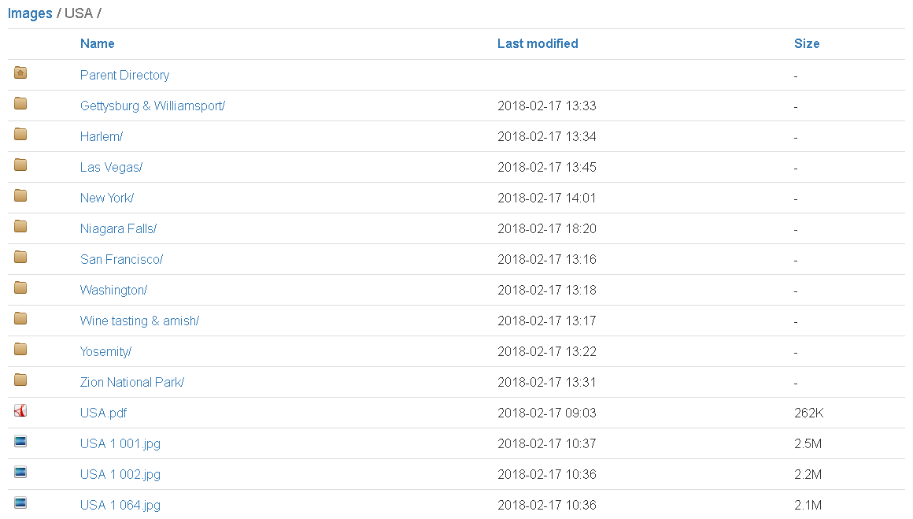
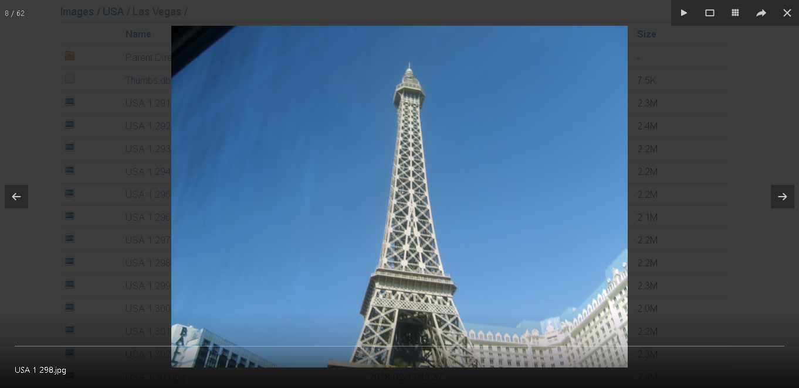

# Apache Directory Archive
This theme is inspired by [Apaxy](https://github.com/oupala/apaxy). The icons for the various file extensions are copied from [Apaxy](https://github.com/oupala/apaxy).

## Setup
1. Download or clone this repository. Copy the `theme` folder and paste it in the root of your site.
2. Copy the `.htaccess` file and paste in the root too.

## Theme
This theme is setup with Bootstrap's table classes and grid system, and has another few functionalities including:
* Fancybox for viewing images and PDF files in the browser.
* Breadcrumb navigation for easy navigation between folders.
* (OPTIONAL) One way to restrict access to your archive is to use basic authentication for your domain. Use the following Apache configuration in your `.htaccess` file to enable this feature:
 `AuthType Basic` 
`AuthName "Private domain"` 
`AuthUserFile /etc/apache2/.htpasswd` 
`Require valid-user`

**Notice** that you will also need to create a `.htpasswd` file for this to work. This file will contain a username and a password. Use [this tool](http://www.htaccesstools.com/htpasswd-generator/) to generate an entry for the `.htpasswd` file. Finally, remember to change the `AuthUserFile` to the correct path for your server.

The following shows the archive in action (I use it mostly for vacation photos).

